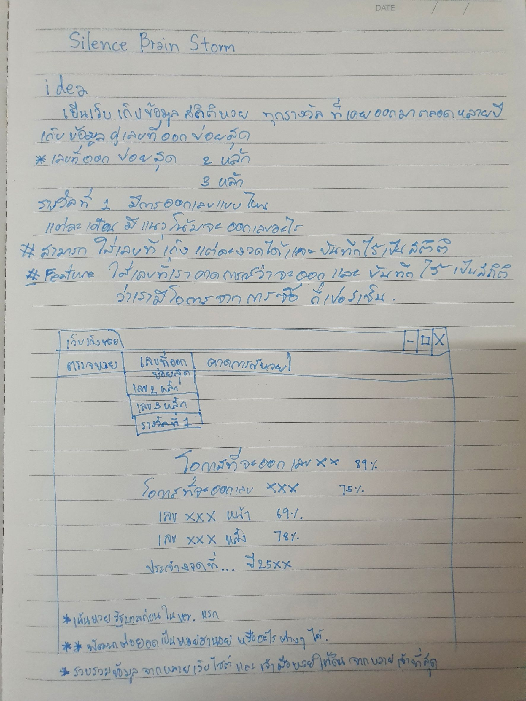
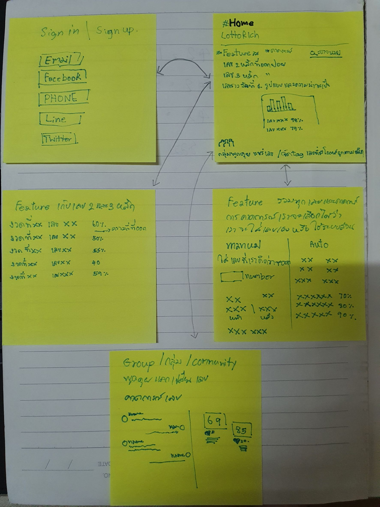

# UX-UI

## Lab 1. หาเว็บไซต์ 1 อัน ให้ครอบคลุม ที่มีไม่ครบ 6 ข้อ   
+ Useful: มีประโยชน์
+ Usable: ใช้งานง่าย
+ Findable: หาสิ่งที่ต้องการได้ง่าย
+ Credible: น่าเชื่อถือ
+ Desirable: น่าใช้
+ Accessible: เข้าถึงได้ง่าย  

> `answer.`  
> เว็บไซต์ที่มีไม่ครบ 6 ข้อ: >> < https://www.xn--q3cpctt8knbo.com/tag/%E0%B9%80%E0%B8%81%E0%B9%87%E0%B8%87%E0%B8%AB%E0%B8%A7%E0%B8%A2/ >  
>+ Useful: มีประโยชน์  / เหมือนจะมีประโยชน์
>+ Usable: ใช้งานง่าย  / ง่ายอยู่
>+ Findable: หาสิ่งที่ต้องการได้ง่าย  / >ง่ายอยู่
>+ Credible: น่าเชื่อถือ  / ก่ำกึ่ง
>+ Desirable: น่าใช้  / >ไม่ค่อยน่าใช้เท่าไหร่นะ
>+ Accessible: เข้าถึงได้ง่าย  / ง่ายอยู่

---

## Lab 2. เล่าเรื่องอะไรก็ได้เกี่ยวกับตัวเอง 3 ข้อ โดย 2 ข้อเป็นเรื่องจริง อีก 1 ข้อ เป็นเรื่องโกหก

+ ผมชอบเล่นเกม
+ ผมชอบดูหนัง
+ ผมชอบเข้าสังคม
---

## Lab 3. คิดทำ Startup อะไรสักอย่าง

### ทำเว็บเก็งหวย

   

--- 

## Lab 4. เขียน Low-Fidelity Wireframe ลง Post-it หนึ่งแผ่นต่อหนึ่งหน้า  
 
`answer.`  

---

## Lab 5. ทำทุกอย่างให้เป็น Figma  
+ Figma - for prototyping  
+ โจทย์ที่ 1 - Login Page  
+ โจทย์ที่ 2 - เปลี่ยนหน้า  
+ โจทย์ที่ 3- ใช้ UI Kit  
 `answer.`  
 [Figma Frame](https://www.figma.com/file/XvzbRv7OwdLPmW44StYWb1/prototype?node-id=0%3A1)    
 

---

## Lab 6. หา Mobile App ที่จะเป็น Inspiration ด้าน design ให้เราได้ อย่างน้อย 3 App

`answer.`  

[Link inspiration](https://www.figma.com/file/V554NLHeuRCE2unR8733Wf/inspiration?node-id=0%3A1)

---

## Lab 7. ทำ Moodboard ใส่ Figma ใส่เป็นอีก File

    > หัวข้อครอบคลุม
    > color palette
    > fonts (1 to 3 per mood board)
    > photography/illustration style
    > iconography (if needed)
    > navigation style
    > spatial awareness (or, white space usage)  

`answer.` 

[Link Moodboard figma](https://www.figma.com/file/V554NLHeuRCE2unR8733Wf/inspiration?node-id=1%3A3)

___